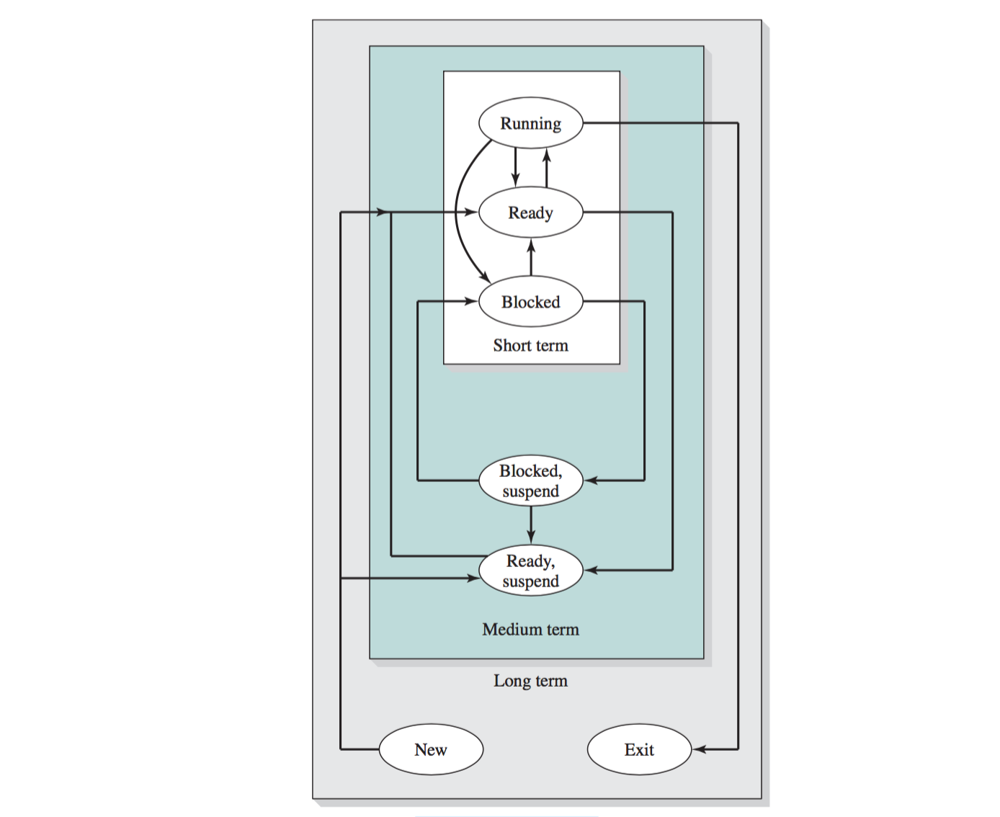

#Operating Systems
> An operating system is system software that manages computer hardware and software resources and provides common services for computer programs.

```
----------------
      User
----------   ---
   	   ⇳
----------   ---
   Application
----------   ---
           ⇳
----------   ---
       OS
----------   ---
           ⇳
----------   ---
    Hardware
----------   ---
```

- OS is a collection of software
	- provides an abstract machine on top of a physical machine.
- OS provides resource management.
- OS makes computer easier to use
	- for end users and programmers.
- Typical services provided by an OS
	- storage / file systems
	- process / thread management
	- security and communications

## [Simulation](simulation.md)
[Simulation: Multiple Threads & Process](simulation.md)

##3. Process Description and Control
- the most fundamental concept in a modern OS is the **process**.
- the **principal function of the OS** is to:
	1. create,
	2. manage,
	3. terminate **processes**.
- While processes are active:
	- the OS must see that each is allocated time for execution by the processor,
	- coordinate their activities
	- manage conflicting demands
	- allocate system resources to processes.
- To preform its process management functions, the OS maintains a description of each process, or process image,
	- which includes the address space within which the process executes, and a process control block.
- the process control block contains all of the information that is required by the OS to manage the process, including:
	- its current state
	- resources allocated to it
	- priority
	- and other relevant data.
- During its lifetime, a process moves among a number of states. The most important of these are:
	- **Ready**
		- A ready process is one that is not currently executing but that is ready to be executed as soon as the OS dispatches it.
	- **Running**
		- The running process is that process that is currently being executed by the processor.
		- In a multiple-processor system, more than one process can be in this state.
		- A running process is interrupted either by an interrupt, which is an event that occurs outside the process and that is recognized by the processor, 
			- or by executing a supervisor call to the OS.
			- In either case, the processor performs a mode switch, transferring control to an operating system routine.
			- The OS, after it has completed necessary work, may resume the interrupted process or switch to some other process.
	- **Blocked**
		- A blocked process is waiting for the completion of some event, such as an I/O operation.

######A process is an instance of a computer program that is being excuted.
- It contains the program code and its current activity.
- Depending on the operating system, a process may be made up of multiple threads of execution that execute instructions concurrently (wikipedia)
- **A computer program is a passive collection of instructions**, 
	- while **a process is the actual execution of those instructions**.
- **Multitasking** is a method to allow multiple processes to share processors (CPU) and other system resources.
	- each CPU executes a single task at a time
	- multitasking allows each processor to switch between tasks that are being executed without having to wait for each task to finish. 
	- The scheduler, using a scheduling algorithm, decides which process get to use a CPU at any given time. 

### Scheduling
> Schedulers are often implemented so they keep all computer resources busy, allow multiple users to share system resources effctively, or to achieve a target quality of service. Scheduling is fundamental to computation itself, and an intrinsic part of execution model of a computer system; the concept of scheduling makes it possible to have computer multitasking with a single central processing unit (CPU).

- The goal is to maximize process throughput, minimize turnaround time, and maximize CPU utilization.
- For interactive systems, the goal is to minimize response time, and ensure proportionality in latency.
- For real time systems, the goal is to meet deadlines and behave predictably. 

## 4. Thread
- some operating systems distinguish the concepts of process and thread, 
	- process related to resource ownership
	- thread related to program execution.
- This approach may lead to improved efficiency and codeing convenience.
- In a multithreaded system, multiple concurrent threads may be defined within a single process. this may be done using either:
	1. user-level threads (or)
		- user-level threads are unknown to the OS and are created and managed by a threads library that runs in the user space of a process. 
		- user-level threads are very efficient because a mode switch is not required to switch from one thread to another.
		- However, only a single user-level thread within a process can execute at a time, and if one thread blocks, the entire process is blocked.
	2. kernel-level threads.
		- Kernel-level threads are threads within a process that are maintained by the kernel.
		- Because they are recognized by the kernel, multiple threads within the same process can execute in parallel on a multiprocessor and the blocking of a thread does not block the entire process.
		- However, a mode switch is required to switch from one thread to another.

> A thread of execution is the smallest sequence of programmed instructions that can be managed independently by a scheduler. 

- On one processor, multithreading is generally implemented by time slicing, and the central processing unit switches between different software threads.
	- this generally happens often enough that users perceive the threads or tasks as running in parallel.
- On a multiprocessor or multi-core system, multiple threads can be executed in parallel, with every processor or core executing a separate thread simultaneously;
	- on a processor or core with hardware threads, separate software threads can also be executed concurrently by separate hardware threads. 

#### Threads vs Processes
- processes are typically independent, 
	- while threads exist as subsets of a process
- processes carry considerably more state information than threads, 
	- whereas multiple threads within a process share process state as well as memory and other resources. 
- processes have separate address spaces, 
	- whereas threads share their address space
- processes interact only through system-provided inter-process communication mechanisms.
- context switching between threads in the same process is typically faster than context switching between processes.

> **Multiprocessor**:		
> - Multiple CPUs tightly coupled enough to cooperate on a single problem.

> **Multithread processors**:	
> - Single CPU core that can execute multiple threads simultaneously. (e.g. simultaneous multithreading)

> **Multicore processors**:	
> - Multiproessor where the CPU cores coexist on a single processor chip.


#### Kernel Level threading
Threads created by the user in a 1 : 1 correspondence with schedulable entities in the kernel are the simplest possible threading implementation.

#### User Level threading
- An N : 1 model implies that all application-level threads map to one kernel-level scheduled entity;
	- the kernel has no knowledge of the application threads
- with this approach, context switching can be done very quickly and, in addition, it can be implemented even on simple kernels which do not support threading.
- major drawbacks
	- it cannot benefit from the hardware acceleration on multithreaded processors or multi-processor computers:
		- there is never more than one thread being scheduled at the same time.

### [Java Class Thread](http://docs.oracle.com/javase/8/docs/api/java/lang/Thread.html)
> A thread is a thread of execution in a program. 
> - The Java Virtual Machine allows an application to have multiple threads of execution running concurrently.
> 
> Every thread has a priority. 
> - Threads with higher priority are executed in preference to threads with lower priority. 
> - Each thread may or may not also be marked as a daemon. 
> 	- When code running in some thread creates a new Thread object, 
> 	- the new thread has its priority initially set equal to the priority of the creating thread, 
> 	- and is a daemon thread if and only if the creating thread is a daemon.
> 
> When a Java Virtual Machine starts up, 
> - there is usually a single non-daemon thread
> 	- (which typically calls the method named main of some designated class). 
> - The Java Virtual Machine continues to execute threads until either of the following occurs:
> 	1. The exit method of class Runtime has been called and the security manager has permitted the exit operation to take place.
> 	2. All threads that are not daemon threads have died, 
> 	 	- either by returning from the call to the run method or 
> 	 	- by throwing an exception that propagates beyond the run method.

There are two ways to create a new thread of execution. 
1. declare a class to be a subclass of (`extends`) `Thread`. 
	- This subclass should override the run method of class Thread. 
	- An instance of the subclass can then be allocated and started.
2. create a thread is to declare a class that `implements` the `Runnable` interface. 
	- That class then implements the run method. 
	- An instance of the class can then be allocated, 
		- passed as an argument when creating Thread, and started. 

##5. Concurrency: Mutual Exclusion and Synchronization
- The central themes of modern operating systems are:
	- multiprogramming
	- multiprocessing
	- distributed processing
- fundamental to these themes, and fundamental to the technology of OS design, is **Concurrency**.
- When multiple processe are executing concurrently, 
	- either actually in the case of a multiprocessor system or virtually in the case of a single-processor multiprogramming system, 
	- issues of conflict resolution and cooperation arise.
- **Concurrent processes** may interact in a number of ways.
	- Processes that are unaware of each other may nevertheless compete for resources, 
		- such as processor time or access to I/O devices.
	- Processes may be indirectly aware of one another because they share access to a common object 
		- such as a block of main memory or a file.
	- Finally, processes may be directly aware of each other and cooperate by the exchange of information.
- the key issues that arise in these interactions are mutual exclusion and deadlock.
- **Mutual exclusion** is a condition in which there is a set of concurrent processes, 
	- only one of which is able to access a given resource or perform a given function at any time.
- Mutual exclusion techniques can be used to resolve conflicts, such as 
	- competition for resources,
	- and to synchronize processes so that they can cooperate.
		- example is the producer/consumer model, 
			- in which one process is putting data into a buffer and 
			- one or more processes are extracting data from that buffer.
- One approach to supporting mutual exclusion involves the use of special-purpose machine instructions.
	- this approach reduces overhead but is still inefficient because it uses busy waiting.
- Another approach to supporting mutual exclusion is to provide features within the OS.
- Two of the most common techniques are:
	1. semaphores
		- semaphores are used for signaling among processes and can be readily used to enforce a mutual-exclusion discipline.
	2. message
		- messages are useful for the enforcement of mutual exclusion and also provide an effective means of interprocess communication.

> **Concurrency** is the property of program, algorithm, or problem decomposability into order independent or partially-ordered components or units. 
> - This means that even if the concurrent units of the program, algorithm, or problem are executed out-of-order or in partial order, 
> - the final outcome will remain the same. 
> - This allows for parallel execution of the concurent units, 
> 	- which can significantly improve the overall speed of execution in multiprocessor and multi-core systems.

The central themes of operating system design are all concerned with management of processes and threads:
- **Multiprogramming**:		The management of multiple processes within a uniprocessor system.
- **Multiprocessing**:		the management of multiple processes within a multiprocessor.
- **Distributed processing**:	
	- The management of multiple processes executing on multiple, distributed computer system. 
		- cluster.

**Fundamental to all of these three areas, and fundamental to OS design, is concurrency**.
- Concurrency encompasses a host of design issues, including 
	- communication among processes, 
	- sharing of and competing for resources
		- memory
		- files
		- I/O access
	- synchronization of the activities of multiple processes, and 
	- allocation of processor time to processes.

> The Java programming language provides two basic synchronization idioms: [synchronized methods and synchronized statements](https://docs.oracle.com/javase/tutorial/essential/concurrency/syncmeth.html).

```java 
synchronized (queue) {
    queue.wait();
}
```
> `public final void wait()`
> - Causes the current thread to wait until another thread invokes 
> 	- the `notify()` method or 
>	- the `notifyAll()` method for this object. 
	- In other words, this method behaves exactly as if it simply performs the call `wait(0)`.

```java
synchronized (gui) {
    if (s > 2) {
        gui.notifyAll();// wakeup all waiting thread
    } else if (s == 2) {
        gui.notify();
        gui.notify();
    } else {
        gui.notify(); // wakeup one waiting thread
    }
}
```

> `public final void notify()`
> - Wakes up a single thread that is waiting on this object's monitor. 
> - If any threads are waiting on this object, 
> 	- one of them is chosen to be awakened. 
> - The choice is arbitrary and occurs at the discretion of the implementation. 
> - A thread waits on an object's monitor by calling one of the wait methods.
 
```java
volatile int s;
```
> [Atomic Access: volatile](https://docs.oracle.com/javase/tutorial/essential/concurrency/atomic.html)
> - Using **`volatile`** variables reduces the risk of memory consistency errors, 
> 	- because any write to a volatile variable establishes a happens-before relationship with subsequent reads of that same variable. 
> - This means that **changes to a volatile variable are always visible to other threads**. 
> - What's more, 
> 	- it also means that when a thread reads a volatile variable, 
> 	- it sees not just the latest change to the volatile, 
> 	 	- but also the side effects of the code that led up the change.

**[The Java volatile Visibility Guarantee](http://tutorials.jenkov.com/java-concurrency/volatile.html)**
> The Java volatile keyword is used to mark a Java variable as "being stored in main memory". 
> - More precisely that means, 
> 	- that every **read** of a volatile variable will be read from the computer's main memory, 
> 	 	- and not from the CPU cache, 
> 	- and that every **write** to a volatile variable will be written to main memory, 
> 	 	- and not just to the CPU cache.
> - **the volatile modifier guarantees that any thread that reads a field will see the most recently written value.**


**[Singleton pattern](https://en.wikipedia.org/wiki/Singleton_pattern)**

- Lazy initialization
    - This method uses double-checked locking, which should not be used prior to J2SE 5.0, as it is vulnerable to subtle bugs. 
    - The problem is that an out-of-order write may allow the instance reference to be returned before the Singleton constructor is executed

```java
public class SingletonDemo {
      private static volatile SingletonDemo instance;
      private SingletonDemo() { }
      public static SingletonDemo getInstance() {
          if (instance == null ) {
              synchronized (SingletonDemo.class) {
                  if (instance == null) {
                      instance = new SingletonDemo();
                  }
              }
          }
          return instance;
      }
}
```


- An alternate simpler and cleaner version may be used at the expense of potentially lower concurrency in a multithreaded environment:

```java
public class SingletonDemo {
    private static SingletonDemo instance = null;
    private SingletonDemo() { }

    public static synchronized SingletonDemo getInstance() {
        if (instance == null) {
            instance = new SingletonDemo();
        }

        return instance;
    }
}
```

- The enum way
    - In the second edition of his book Effective Java, Joshua Bloch claims that "a single-element enum type is the best way to implement a singleton" for any Java that supports enums. 
        - The use of an enum is very easy to implement and has no drawbacks regarding serializable objects...
    - This approach implements the singleton by taking advantage of Java's guarantee that any enum value is instantiated only once in a Java program. 
        - Since Java enum values are globally accessible, so is the singleton, initialized lazily by the class loader. 
        - The drawback is that the enum type is somewhat inflexible.

```java 
public enum Singleton {
    INSTANCE;
    public void execute (String arg) {
        // Perform operation here 
    }
}
```

##6. Concurrency: Deadlock and Starvation
- Deadlock is the blocking of a set of processes that either compete for system resources or communicate with each other.
- The blockage is permanent unless the OS takes some extraordinary action, 
	- such as killing one or more processes or forcing one or more processes to backtrack.
- Deadlock may involve reusable resources or consumable resources.
	- A reusable resources is one that is not depleted or destroyed by use, such as an I/O channel or a region of memory.
	- A consumable resource is one that is destroyed when it is acquired by a process;
		- examples include messages and information in I/O buffers.

###### There are three general approaches to dealing with deadlock:

1. **prevention**
	- Deadlock prevention guarantees that deadlock will not occur, by assuring that one of the necessary conditions for deadlock is not met.
2. **detection**
	- Deadlock detection is needed if the OS is always willing to grant resource request
	- periodically, the OS must check for deadlock and take action to break the deadlock.
3. **avoidance**
	- Deadlock avoidance involves the analysis of each new resource request to determine if it could lead to deadlock, 
	- and granting it only if deadlock is not possible.

### Principles of Deadlock
**Deadlock** can be defined as 
- the permanent blocking of a set of processes that 
	- either compete for system resources 
	- or communicate with each other.

> In concurrent programming, 
> - **a deadlock** is a situation in which 
> 	- two or more computing actions are each 
> 	- waiting for the other to finish, and thus **neither ever does**.


> - four processes (blue lines) compete for one resource (grey circle), 
> - following a right-before-left policy. 
> - A deadlock occurs when all processes lock the resource simultaneously (black lines). 
> - The deadlock can be resolved by breaking the symmetry. (wikipedia)

Four deadlock conditions:

Three conditions of policy must be present for a deadlock to be possible:
1. **Mutual exculusion**
	- A resource can only be assigned to one or no process at onece. 
2. **Hold and wait**
	- Processes currently holding resources can request more resources.
3. **No preemption**
	- Processes cannot lose a resource against its will.
> In many ways these conditions are quite desirable.
> - for example: **Mutual exclusion** is needed to ensure consistency of results and the integrity of a data base.
> - **Preemption** should not be done arbitrarily.
> 	- when data resources are involved, preemption must be supported by a rollback recovery mechanism, which restores a process and its resources to a suitable previous state from which the process can eventually repeat its actions.
4. **Circular wait**
	- There must be a circular chain of two or more processes, each waiting for a resource held by the next member of the chain.

> Deadlock prevention can be done by preventing one or more of the four conditions above.

### Deadlock prevention
The strategy of deadlock prevention is, simply put, to design a system in such a way that the possibility of deadlock is excluded. 
 
### Deadlock avoidance
In **deadlock prevention** we constrain resource requests to prevent at least one of the four conditions of deadlock.
- this is either done indirectly, by preventing one of the three necessary policy conditions (mutual exclusion, hold and wait, no preemption), or 
- directly, by preventing circular wait.

**Deadlock avoidance**, on the other hand, allows the three necessary conditions but makes judicious choices to assure that the deadlock point is never reached.
- avoidance allows more concurrency than prevention.
- whith deadlock avoidance, a decision is made dynamically whether the current resource allocation request will, if granted, potentially lead to a deadlock.
	- Deadlock avoidance requires knowledge of further process resource requests.

Two apporaches to deadlock avoidance:
1. do not start a process if its demands might lead to deadlock.
2. do not grant an incremental resource request to a process if allocation might lead to deadlock.

### Deadlock detection
Deadlock prevention strategies are very conservative;
- they solve the problem of deadlock by limiting access to resources and by imposing restrictions on processes. 
- **Deadlock detection** strategies do not limit resource access or restrict process actions.
- With deadlock detection, requested resources are granted to processes whenever possible.

## 7. Memory Management
- One of the most important and complex tasks of an operating system is memory management.
- Memory management involves treating main memory as a resource to be allocated to and shared among a number of active processes.
- To use the processor and the I/O facilities efficiently
	- it is desirable to maintain as many processes in main memory as possible.
	- In addition, it is desirable to free programmers from size restrictions in program development.
- The basic tools of memory management are paging and segmentation.
	- **Paging**
		- each process is divided into relatively small, fixed-size pages.
	- **Segmentation**
		- segmentation provides for the use of pieces of varying size. 
	- it is also possible to combine segmentation and paging in a single memory management scheme.

> Memory management is the act of managing computer memory at the system level. The essential requirement of memory management is to provide ways to dynamically allocate portions of momory to programs at their request, and free it for reuse when no longer needed. This is critical to any advanced computer system where more than a single process might be underway at any time. (wikipedia)

### Memory management requirements

The requirements that memory management is intended to satisfy include:

1. Relocation
	- relocate the process to a different area of memory.
2. Protection
	- each process should be protected against unwanted interference by other processes, whether accidental or intentional.
	- programs in other processes should not able to reference memory locations in a process for reading or writing purposes without permission.
3. Sharing
	- Any protection mechanism must have the flexibility to allow several processes to access the same portion of main memory.
		- e.g. if a number of processes are executing the same program, it is advantageous to allow each process to access the same copy of the program rather than have its own separate copy.
4. Logical organization
5. Physical organization
	- computer memory if organized into at least two levels:
		1. Main memory
			- main memory provides fast access at relatively high cost;
			- main memory is **volatile**: it does not provide permanent storage.
		2. Secondary memory
			- secondary memory is slower and cheaper than main memory and is usually not volatile.
			- secondary memory of large capacity can be provided for long-term storage of programs and data,
			- while a smaller main memory holds programs and data currently in use.
	- the task of moving information between the two levels of memory should be a system responsibility.

### 7.2 Memory partitioning
- The principal operation of memory management is to bring processes into main memory for execution by the processor.
- In almost all modern multiprogramming systems, this involves a sophisticated scheme known as virtual memory.
	- Virtual memory is, in turn, based on the use of one or both two basic techniques:
		- segmentation and paging.

Table 7.2 **Memory Management Techniques**

Technique			|Description		|Strengths		|Weaknesses
---				|---			|---			|---
Fixed Partitioning		|Main memory is divided into a number of static partitions at system generation time. A process may be loaded into a partition of equal or greater size.			|Simple to implement; little operating system overhead.					|Inefficient use of memory due to internal fragmentation; maximum number of active processes is fixed.
Dynamic Partitioning		|Partitions are created dynamically, so that each process is loaded into a partition of exactly the same size as that process.							|No internal fragmentation; more efficient use of main memory.				|Inefficient use of processor due to the need for compaction to counter external fragmentation.
Simple Paging			|Main memory is divided into a number of equal-size frames. Each process is divided into a number of equal-size pages of the same length as frames. A process is loaded by loading all of its pages into available, not necessarily contiguous, frames. 		|No external fragmentation.|A small amount of internal fragmentation.
Simple Segmentation		|Each process is divided into a number of segments. A process is loaded by loading all of its segments into dynamic partitions that need not be contiguous. 			|No internal Fragmentation; improved memory utilization and reduced overhead compared to dynamic partitioning.	|External fragmentation.
Virtual Memory Paging		|As with simple paging, except that it is not necessary to load all of the pages of a process. Nonresident pages that are needed are brought in later automatically.		|No external fragmentation; higher degree of multiprogramming; large virtual address space.	|Overhead of complex memory management.
Virtual Memory Segmentation	|As with simple segmentation, except that it is not necessary to load all of the segments of a process. Nonresident segments that are needed are brought in later automatically.	|No internal fragmentation, higher degree of multiprogramming; large virtual address space; protection and sharing support. | Overhead of complex memory management.

### 7.3 Paging
> Main memory is partitioned into equal fixed-size chunks that are relatively small, 
> - and that each process is also divided into small fixed-size chunks of the same size. 
> - Then the chunks of a process, known as pages, 
> 	- could be assigned to available chunks of memory, known as frames, or page frames.

### 7.4 Segmentation
- A user program can be subdivided using segmentation, 
	- in which the program and its associated data are divided into a number of segments.
- It is not required that all segments of all programs be of the same length, 
	- although there is a maximum segment length.
- As with paging, a logical address using segmentation consists of two parts, 
	- in this case a segment number and an offset.
- **paging** is invisible to the programmer, 
- **segmentation** is usually visible and is provided as a convenience for organizing programs and data.
	- typically, the programmer or compiler will assign programs and data to different segments.

##8. Virtual Memory
- To use the processor and the I/O facilities efficiently, it is desirable to maintain as many processes in main memory as possible.
	- In addition, it is desirable to free programmers from size restrictions in program development.
- The way to address both of these concerns is virtual memory. 
	- With virtual memory, all address references are logical references that are translated at run time to real addresses.
	- This allows a process to be located anywhere in main memory and for that location to change over time.
	- Virtual memory also allows a process to be broken up into pieces. 
	- These pieces need not be contiguously located in main memory during execution and, indeed, 
	- it is not even necessary for all of the pieces of the process to be in main memory during execution.
- A virtual memory management scheme requires both hardware and software support.
	- The hardware support is provided by the processor.
	- The support includes dynamic translation of virtual addresses to physical addresses and the generation of an interrupt when a referenced page or segment is not in main memory.
	- Such an interrupt triggers the memory management software in the OS.
- A number of design issues relate to OS support for memory management:
	- **Fetch policy**: 
		- Process pages can be brought in on demand, 
		- or a prepaging policy can be used,
		- which clusters the input activity by bringing in a number of pages at once.
	- **Placement policy**:
		- With a pure segmentation system, 
		- an incoming segment must be fit into anavailable space in memory.
	- **Resident set management**:
		- The OS must decide how much main memory to allocate to a particular process when that process is swapped in.
		- This can be a static allocation made at process creation time, or it can change dynamically.
	- **Cleaning policy**:
		- Modified process pages can be written out at the time of replacement, 
		- or a precleaning policy can be used, which clusters the output activity by writing out a number of pages at once.
	- **Load control**:
		- Load control is concerned with determining the number of processes that will be resident in main memory at any given time.

### 8.1 Hardware and Control structures
Table 8.1

name			| description 
---			| ---
**Virtual memory**	|A storage allocation scheme in which secondary memory can be addressed as though it were part of main memory.
**Virtual address**	|The address assigned to a location in virtual memory to allow that location to be accessed as though it were part of main memory.
**Virtual address space**|The virtual storage assigned to a process.
**Address space**	|The range of memory address available to a process.
**Real address**	|The address of a storage location in main memory.		

**Two characteristics of paging and segmentation:**

1. All memory references within a process are logical addresses that are dynamically translated into physical addresses at run time.
	- This means that a process may be swapped in and out of main memory such that it occupies different regions of main memory at different times during the course of execution.
2. A process may be broken up into a number of pieces (pages or segments) and these pieces need not be contiguously located in main memory during execution.
	- The combination of dynamic run-time address translation and the use of a page or segment table permits this.

If the preceding two characteristics are present, then it is not necessary that all of the pages or all of the segments of a process be in main memory during execution.

Improved system utilization:

1. **More processes may be maintained in main memory**.
	- Because we are only going to load some of the pieces of any particular process, 
	- there is room for more processes.
	- This lead to more efficient utilization of the processor because it is more likely that at least one of the more numerous prcesses will be in a Ready state at any particular time.
2. **A process may be larger than all of main memory**.
	- One of the most fundamental restricitions in programming is lifted.
	- Without the scheme we have been discussing, 
		- a programmer must be acutely aware of how much memory is available.
	- If the program being written is too large, 
		- the programmer must devise ways to structure the program into pieces 
			- that can be loaded separately in some sort of overlay strategy.
		- With virtual memory based on paging or segmentation, 
			- that job is left to the OS and the hardware.
			- The OS automatically loads pieces of a process into main memory as required.

> A process executes only in main memory, referred as **real memory**.
> 
> A much larger memory is allocate on disk, referred as **virtual memory**.
 
##9. Uniprocessor Scheduling 

> In a multiprogramming system, multiple processes exist concurrently in **main memory**.
> - Each process alternates between using a processor and waiting for some event to occur,
>   - such as the completion of an I/O operation.
> 
> The **processor** or processors are kept busy by executing one process while the others wait.

The key to multiprogramming is scheduling. Four types of scheduling are typically involved.

1. **Long-term scheduling**
    - The decision to add to the pool of processes to be executed.
2. **Medium-term scheduling**
    - The decision to add to the number of processes that are partially or fully in main memory.
3. **Short-term scheduling**
    - The decision as to which available process will be executed by the processor.
4. **I/O scheduling**
    - The decision as to which process's pending I/O request shall be handled by an available I/O device.

###### Key points of this chapter:

- The OS must make three types of scheduling decisions with respect to the execution of processes.
	1. Long-term 	scheduling determines when new processes are admitted to the system.
	2. Medium-term 	scheduling is part of the swapping function and determines when a program is brought partially or fully into main memory so that it may be executed.
	3. Short-term 	scheduling determines which ready process will be executed next by the processor.
- A variety of criteria are used in designing the short-term scheduler.
	- Some of these criteria relate to the behavior of the system as perceived by the individual user (user oriented),
		- while others view the total effectiveness of the system in meeting the needs of all users (system oriented).
	- Some of the criteria relate specifically to quantitative measures of performance,
		- while others are more qualitative in nature.
	- From a user's point of view, response time is generally the most important characteristic of a system,
		- while from a system point of view, throughput or processor utilization is important.
- A variety of algorithms have been developed for making the short-term scheduling decision among all ready processes:
	- **First-come-first-served** (først-inn-først-ut)
		- Select the process that has been waiting the longest for service.
	- **Round robin** (Kontinuerlig rundgang)
		- Use time slicing to limit any running process to a short burst of processor time, and rotate among all ready processes.
	- **Shortest process next** (Korteste totaltid først)
		- Select the process with the shortest expected processing time, and do not preempt the process.
	- **Shortest remaining time** (Korteste gjenværende tid først)
		- Select the process with the shortest expected remaining process time.
		- A process may be preempted when another process becomes ready.
	- **Highest response ratio next** (Høyeste responsforhold først)
		- Base the scheduling decision on an estimate of normalized turnaround time.
	- **Feedback** (Tilbakekopling)
		- Establish a set of scheduling queues and allocate processes to queues based on execution history and other criteria.

The choice of scheduling algorithm will depend on expected performance and on implementation complexity.

### 9.1 Types of processor scheduling
- The aim of processor scheduling is to assign processes to be executed by the processor or processors over time.
    - in a way that meets system objectives, such as:
        - response time
		- throughput
		- processor efficiency
- In many systems, this scheduling activity is broken down into three separate functions:
    1. long-term scheduling
		- Determines which programs are admitted to the system for processing
		- Controls the degree of multiprogramming
		- More processes, smaller percentage of time each process is executed
    2. medium-term scheduling
		- Part of the swapping function
		- Based on the need to manage the degree of multiprogramming
    3. short-term scheduling
		- Know as the dispatcher
		- Executes most frequently
		- Invoked when an event occurs
			- Clock interrupts
			- I/O interrupts
			- Operating system calls
			- Signals (e.g., semaphores)

###### Levels of Scheduling


###### Queueing diagram for Scheduling


###### Tidsstyring - Prosesstilstand


### 9.2 Scheduling Algorithms
###### User Oriented, Performance Related:
- **Turnaround time**
	- the interval of time between the submission of a process and its completion.
	- Includes actual execution time plus time spent waiting for resources, including the processor.
	- is an appropriate measure for a batch job.
- **Response time**
	- for an interactive process, 
		- this is the time from the submission of a request until the response begins to be received.
	- Often a process can begin producing some output to the user while continuing to process the request.
	- Thus, this is a better measure than turnaround time from the user's point of view.
	- The scheduling discipline should attempt to achieve low response time and to maximize the number of interactive users receiving acceptable response time.
- **Deadlines**
	- When process completion deadlines can be specified, 
		- the scheduling discipline should subordinate other goals to that of maximizing the percentage of deadlines met.

###### User Oriented, Other
- **Predictability**
	- A given job should run in about the same amount of time and at about the same cost regardless of the load on the system.
	- A wide variation in response time or turnaround time is distracting to users.
	- It may signal a wide swing in system workloads or the need for system tuning to cure instabilities.

###### System Oriented, Performance Related
- **Throughput**
	- the scheduling policy should attempt to maximize the number of processes completed per unit of time.
	- This is a measure of how much work is being performed.
	- This clearly depends on the average length of a process but is also influenced by the scheduling policy, which my affect on utilization.
- **Processor utilization**
	- is the percentage of time that the processor is busy.
	- For an expensive shared system, this is a significant criterion.
	- In single-user systems and in some other systems, such as real-time systems, this criterion is less important than some of the others.

###### System Oriented, Other
- **Fairness**
	- In the absence of guidance from the user or other system-supplied guidance, processes should be treated the same, and no process should suffer starvation.
- **Enforcing priorities**
	- When processes are assigned priorities, the scheduling policy should favor higher-priority processes.
- **Balancing resources**
	- The scheduling policy should keep the resources of the system busy.
	- Processes that will underutilize stressed resources should be favored.
	- This criterion also involves medium-term and long-term scheduling.

##10. Multiprocessor and Real-Time Scheduling
- With a tightly coupled multiprocessor, multiple processors have access to the same main memory.
	- In this configuration, the scheduling structure is somewhat more complex.
		- e.g., a given process may be assigned to the same processor for its entire life or dispatched to any processor each time it enters the Running state.
	- Performance studies suggest that the differences among various scheduling algorithms are less significant in a multiprocessor system.
- A real-time process or task is one that is executed in connection with some process or function or set of events external to the computer system and that must meet one or more deadlines to interact effectively and correctly with the external environment.
	- A real-time operating system is one that is capable of managing real-time processes.
		- In this context, the traditional criteria for a scheduling algorithm do not apply.
		- Rather, the key factor is the meeting of deadlines.
		- Algorithms that rely heavily on preemption and on reacting to relative deadlines are appropriate in this context.

### 10.1 Multiprocessor scheduling
###### Multiprocessor systems:
- **Loosely coupled or distributed multiprocessor, or cluster**
	- consists of a collection of relatively autonomous systems,
		- each processor having its own main memory and I/O channels.
- **Functionally sepcialized processors**
	- An example is an I/O processor.
		- there is a master, general-purpose processor;
		- specialized processors are controlled by the master processor and provide services to it.
- **Tightly coupled multiprocessor**
	- Consists of a set of processors that share a common main memory and are under the integrated control of an operating system.

### 10.2 Real-Time Scheduling
###### Real-time computing
- the correctness of the system depends not only on the logical result of the computation
	- but also on the time at which the results are produced.
- in a real-time system, some of the tasks are real-time tasks, and these have a certain degree of urgency to them.
	- **real-time task**:
		- real-time task must be able to keep up with the events with which it is concerned.
		- usually it is possible to associate a deadline with a particular task,
			- the deadline specifies either a start time or a completion time.
		- a task may be classified as hard or soft:
			1. **hard real-time task**: is one that must meet its deadline, otherwise it will cause unacceptable damage or a fatal error to the system.
			2. **soft real-time task**: has an associated deadline that is desirable but not mandatory; it still makes sense to schedule and complete the task even if it has passed its deadline.

##11. I/O Management and Disk Scheduling
> Perhaps the messiest aspect of operating system design is input/output. Because there is such a wide variety of devices and applications of those devices, it is difficult to develop a general, consistent solution.

###### Key points 
- The computer system's interface to the outside world is its I/O architecture.
	- This architecture is designed to provide 
		- a systematic means of controlling interaction with the outside world 
		- and to provide the operating system with the information it needs to manage I/O activity effectively.
- The I/O function is generally broken up into a number of layers,
	- with lower layers dealing with details that are closer to the physical functions to be performed 
		- and higher layers dealing with I/O in a logical and generic fashion.
	- The result is that changes in hardware parameters need not affect most of the I/O software.
- A key aspect of I/O is the use of buffers that are controlled by I/O utilities rather than by application processes.
	- Buffering smoothes out the differences between the internal speeds of the computer system and the speeds of I/O devices.
	- The use of buffers also decouples the actual I/O transfer from the address space of the application process.
	- This allows the operating system more flexibility in performing its momory-management function.
- The aspect of I/O that has the greatest impact on overall system performance is disk I/O.
	- Accordingly, there has been greater research and design effort in this area than in any other kind of I/O.
	- Two of the most widely used approaches to improve disk I/O performance are disk scheduling and the disk cache.
- At any time, there may be a queue of request for I/O on the same disk.
	- It is the object of disk scheduling to satisfy these requests in a way that minimizes the mechanical seek time of the disk and hence improves performance.
	- The physical layout of pending requests plus considerations of locality come into play.
- A disk cache is a buffer,
	- usually kept in main memory,
	- that functions as cache of a dick blocks between disk memory and the rest of the main memory.
	- Because of the principle of locality,
	- the use of a disk cache should substantially reduce the number of block I/O transfers between main memory and disk.

### 11.1 I/O devices
external devices engage in I/O with computer systems can be roughly grouped into:

1. **Human readable**:
	- Suitable for communicating with the computer user.
		- e.g.
			- printers
			- terminals, consisting of video display
			- keyboard
			- mouse
2. **Machine readable**:
	- Suitable for communicating with electronic equipment.
		- e.g.
			- disk drives
			- USB keys
			- sensors
			- controllers
			- actuators
3. **Communication**:
	- Suitable for communicating with remote devices.
		- e.g.
			- digital line drives
			- modems.

### 11.2 Organization of the I/O function:
three techniques for performing I/O

1. **Programmed I/O**:
	- the processor issues an I/O command, on behalf of a process, to an I/O module;
	- that process then busy waits for the operation to be completed before proceeding.
2. **Interrupt-driven I/O**:
	- The processor issues an I/O command on behalf of a process.
	- There are then two possibilities.
		1. If the I/O instruction from the process is nonblocking, 
			- then the processor continues to execute instructions from the process that issued the I/O command.
		2. If the I/O instruction is blocking,
			- then the next instruction that the processor executes is from the OS,
			- which will put the current process in a blocked state and schedule another process.
3. **Direct memory access (DMA)**:
	- A DMA module controls the exchange of data between main momory and an I/O module.
	- The processor sends a request for the transfer of a block of data to the DMA module and is interrupted only after the entire block has been transferred.

### 11.3 Operating system design issues
###### Design Objectives
Two objectives are paramount in designing the I/O facility:

1. efficiency 
	- I/O operations often form a bottleneck in a computing system.
	- most I/O devices are extremely slow compared with main memory and the processor.
	- one way to tackle this is multiprogramming,
		- some processes to be waiting on I/O operations while another process is executing.
	- Swapping is used to bring in additional ready processes to keep the processor busy.
2. generality
	- in the interests of simplicity and freedom from error,
		- it is desirable to handle all devices in a uniform manner.
	- use a hierarchical, modular approach to the design of the I/O function.

###### Logical Structure of the I/O function
**A Model of I/O Organization**

```
  User                      User                    User
processes                 processes               processes
                                                     ⥮
   ⥮                         ⥮                    Directory
                                                  management
                                                     ⥮
 Logical                Communication               File
   I/O                  architecture               system
                                                     ⥮
    ⥮                         ⥮                    Physical
                                                 organization 
                                                     ⥮
 Device                    Device                  Device
  I/O                       I/O                     I/O
   ⥮                         ⥮                       ⥮
Scheduling               Scheduling               Scheduling
& control                & control                & control
   ⥮                         ⥮                       ⥮
 Hardware                 Hardware                 Hardware
   -                         -                       - 
(a) Local                   (b)                     (c)
peripheral              Communications              File
 device                     port                   system
```

The (a) **Local peripheral device** is the simplest case that communicates in a simple fashion, e.g. a stream of bytes or records. The following layers are involved:
- **Logical I/O**
	- deals with the device as a logical resource and is not concerned with the details of actually controlling the device.
	- The logical I/O module is concerned with managing general I/O functions on behalf of user processes,
		- allowing them to deal with the device in terms of a device identifier and simple commands such as open, close, read, and write.
- **Device I/O**
	- The requested operations and data (buffered characters, records etc.) are converted into appropriate sequences of I/O instructions, channel commands, and controller orders.
	- buffering techiques may be use to improve utilization.
- **Scheduling and control**
	- the actual queueing and scheduling of I/O operations occurs at this layer,
		- as well as the control of the operations.
	- interrupts are handled at this layer 
	- and I/O status is collected and reported.
	- This is the layer of software that actually interacts with the I/O module and hence the device hardware.

For a communications device (b), looks same as (a) Local peripheral device, 
- the difference is that the logical I/O module is replaced by a communications architecture, 
	- which may itself consist of a number of layers.
		- e.g. TCP/IP.

File system (c) shows a representative structure for managing I/O on a secondary storage device that supports a file system.
- **Directory management**
	- symbolic file names are converted to identifiers that either reference the file directly or indirectly through a file descriptor or index table.
	- This layer is also concerned with user operations that affect the directory of files,
		- such as add, delete, and reorganize.

- **File system**
	- deals with the logical structure of files and with the operations that can be specified by users, 
		- such as open, close, read, and write.
	- Access rights are also managed at this layer.
- **Physical organization**
	- just as virtual memory addresses must be converted into physical main memory addresses,
		- the segmentation and paging structure, 
		- logical references to files and records
		- must be converted to physical secondary storage addresses.
	- Allocation of secondary storage space and main storage buffers is generally treated at this layer as well.

### 11.4 I/O buffering
To avoid overheads and inefficiencies, it is sometimes convenient to 

- perform input transfers in advance of requests being made and to perform output transfers some time after the request is made.
- this techique is known as buffering.

### 11.5 Disk scheduling
Disk are significant slower than memory, and the gap is expected to continue in the future.
###### Disk performance parameters

- **Seek time**
- **Rotational delay**
- **Transfer time**

### 11.6 RAID
### 11.7 Disk Cache

##12. File Management
- A file management system is a set of system software that provides services to users and applications in the use of files,
	- including file access, directory maintenance, and access control.
	- The file management system is typically viewed  as a system service that itself is served by the operating system,
		- rather than being part of the operating system itself.
	- However, in any system, at least part of the file management function is performed by the operating system.
- A file consists of a collection of records.
	- The way in which these records may be accessed determines its logical organization,
		- and to some extent its physical organization on disk.
	- If the file is primarily to be processed as a whole, 
		- then a sequential file organization is the simplest and most appropriate.
	- If sequential access is needed but random access to individual file is also desired, 
		- then an indexed sequential file may give the best performance.
	- If access to the file is principally random, 
		- then an indexed file or hashed file may be the most appropriate.
- Whatever file structure is chosen, a directory service is also needed.
	- This allows files to be organized in a hierarchical fashion. 
	- This organization is useful to the user in keeping track of files and is useful to the file management system in providing access control and other services to users.
- File records, even when of fixed size, generally do not conform to the size of a physical disk block.
	- Accordingly, some sort of blocking strategy is needed.
	- A trade off among complexity, performance, and space utilization determines the blocking strategy to be used.
- A key function of any file management scheme is the management of disk space.
	- Part of this function is the strategy for allocating disk blocks to a file.
	- A variety of methods have been employed,
		- and a variety of data structures have been used to keep track of the allocation for each file.
	- In addition, the space on disk that has not been allocated must be managed.
	- This latter function primarily consists of maintaining a disk allocation table indicating which blocks are free.

### 12.1 Overview
###### Files and File Systems
From the users perspective, one of the most important parts of an operting system is the **file system**.

- the file system provides the resource abstractions
	- typically associated with secondary storage.
	- file system permits users to create data collections, called files, which has properties:
		- **Long-term existence**
		- **Sharable between processes**
		- **Structure**
- Any file system provides not only means of data organized as files but functions can performed on files:
	- **Create**
	- **Delete**
	- **Open**
	- **Close**
	- **Read**
	- **Write**
- Typically, a file system maintains a set of attributes associated with the file.
	- include:
		- owner
		- creation time
		- time last modified
		- access privileges ...

###### File Structure
Four common terms:

1. **Field**
	- the basic element of data.
2. **Record**
	- is a collection of related fields that can be treated as a unit by some application program.
3. **File**
	- is a collection of similar records.
4. **Database**
	- is a collection of related data.

### 12.2 File organization and access
###### File organization
- file organization refer to the logical structuring of the records as determined by the way in which they are accessed.
- the physical organization of the file on secondary storage depends on the blocking strategy and the file allocation strategy.
- Criteria of file organization:
	- short access time
	- ease of update
	- economy of storage
	- simple maintenance
	- reliability

### 12.3 B-Trees
- For a large file or database, a single sequential file of indexes on the primary key does not provide for rapid access.
- A structured index file is used to provide more efficient access.
- A balanced tree structure, with all branches of equal length, would appear to give the best average performance.
	- Which is the **B-Tree**:
		- has become the standard method of organizing indexes for databases 
		- and is commonly used in OS file system.
	- The **B-Tree** structure provides efficient:
		- searching,
		- adding,
		- deleting of items.

### 12.4 File Directories
- Associated with any file management system and collection of files is a file directory.
	- The file directory contains informations about the files, including:
		- attribute
		- location
		- ownership
	- Much of the information, especially that concerned with storage,
		- is managed by operating system.
	- the directory is itself a file,
		- accessible by various file management routines.

### 12.5 File sharing
- In a multiuser system there is almost always a requirement for allowing files to be shared among a number of users.
- Two issues arise:
	1. **Access Rights**
	2. **Simultaneous Access**

### 12.6 Record Blocking

### 12.7 Secondary storage management
- On secondary storage, a file consists of a collection of blocks.
- The Operating System or file management system is responsible for allocating blocks to files.
- Two management issues:
	1. space on secondary storage must be allocated to files.
	2. it is necessary to keep track of the space available for allocation.


#References:

- [Java docs Class Thread](http://docs.oracle.com/javase/8/docs/api/java/lang/Thread.html)
- William Stallings **Operating Systems: Internals and Design Principles** 7th Edition & 8th Edition
- NTNU: TDT4186: Operativsystemer
- Wikipedia
