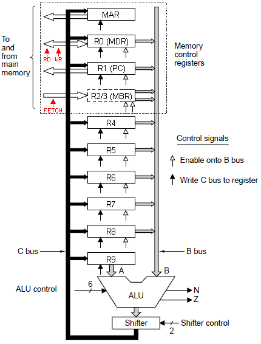

##[Operating Systems](OperatingSystems/)
###[Operativsystemer](OperatingSystems/README.md)

Computer Fundamentals
==

**Computer Systems Organization** 6ed
1 Introduction
--

2 Computer Systems
--

###Instruction-Level parallelism
    - instruction-level parallelism
    - processor-level parallelism

#####Pipelining
A pipeline is a set of data processing elements connected in series, where the output of one element is the input of the next one. The elements of a pipeline are often executed in parallel or in time-sliced fashion; in that case, some amount of buffer storage is often inserted between elements.

Pipelining allows a trade-off between latency (how long it takes to excute an instruction) and processor bandwidth.


**Computer-related pipelines include:**
- Instruction pipelines, such as the classic RISC pipeline, which are used in central processing units (CPUs) to allow overlapping execution of multiple instructions with the same circuitry. The circuitry is usually divided up into stages, including instruction decoding, arithmetic, and register fetching stages, wherein each stage processes one instruction at a time.
- Graphics pipelines, found in most graphics processing units (GPUs), which consist of multiple arithmetic units, or complete CPUs, that implement the various stages of common rendering operations (perspective projection, window clipping, color and light calculation, rendering, etc.).
- Software pipelines, where commands can be written where the output of one operation is automatically fed to the next, following operation. The Unix system call pipe is a classic example of this concept, although other operating systems do support pipes as well.

#####Superscalar Architectures
A superscalar CPU architecture implements a form of parallelism called instruction-level parallelism within a single processor. It therefore allows faster CPU throughput than would otherwise be possible at a given clock rate. A superscalar processor executes more than one instruction during a clock cycle by simultaneously dispatching multiple instructions to different functional units on the processor. **Each functional unit is not a separate CPU core but an execution resource within a single CPU such as an arithmetic logic unit, a bit shifter, or a multiplier**.

A superscalar CPU is typically also pipelined, pipelining and superscalar architecture are considered different performance enhancement techniques.
    (a ^ b)

If one pipeline is good, then surely two pipelines are better. **Dual pipeline cpu**:

Here a single instruction fetch unit fetches pairs of instructions together and puts each one into its own pipeline, complete with its own ALU for parallel operation.

**superscalar architecture**:
- more pipelines need duplicate too much hardwares!
- Instead, a different approach is used on high-end CPUs. **The basic idea is to have just a single pipeline but give it multiple functional units**:


    superscalar is used to describe processors that issue multilple instructions - often four or six - in a single clock cycle.

    a superscalar cpu must have multiple functional units to hand all these instructions.

    superscalar cpu generally have one pipeline.

    In reality, most of the functional units in stage 4 take appreciably longer than one clock cycle to execute, certainly the ones that access memory or do floating-point arithmetic. As can be seen from the figure, it is possible to have multiple ALUs in stage S4.

###Processor-Level parallelism
#####Data Parallel Computers
Data parallelism is a form of parallelization of computing across multiple processors in parallel computing environments. Data parallelism focuses on distributing the data across different parallel computing nodes. It contrasts to task parallelism as another form of parallelism.

**Single Instruction-stream Multiple Data-stream** or **SIMD** processor: 
- consists of a large number of identical processors that perform the same sequence of instructions on different sets of data. 

**Graphics processing units GPU** heavily rely on SIMD:
- because most of the algorithms are highly regular, with repeated operations on pixels, vertices, textures, and edges.

#####Multiprocessors
The processing elements in a data prallel processor are not independent CUPs, since there is only one control unit shared among all of them.

Multiprocessor is a system with more than one CPU sharing a common memory.


#####Multicomputers
A system consisting of large numbers of interconnected computers, each having its own private memory, but no common memory.
###Primary memory
Primary memory, Primary storage (or main memory or internal memory), often referred to simply as memory, is the only one directly accessible to the CPU. The CPU continuously reads instructions stored there and executes them as required. Any data actively operated on is also stored there in uniform manner.
computer storage types:

####Bits
The basic unit of memory is the binary digit, called a bit which contains a 0 or 1.
####Memory addresses
Memories consist of a number of cells (or locations), each can store a piece of information. Each cell has a number, called its address (programs can refer to it).
- a cell (location) consists k bits: can hold 2^k bit combinations.

#####Cache Memory
Historically, CPU have always been faster than memories. 

Cache: the most heavily used memory words are kept in the cache. When the CPU need a word, it first looks in the cache, only if the word is not there CPU look at main me mory.
    - when a word is referenced, it and some of its neighbors are brought from the large slow memory into the cache, so that next time it is used, it can be accessed quickly.

######Memory wall
The "memory wall" is the growing disparity of speed between CPU and memory outside the CPU chip. An important reason for this disparity is the limited communication bandwidth beyond chip boundaries. From 1986 to 2000, CPU speed improved at an annual rate of 55% while memory speed only improved at 10%. Given these trends, it was expected that memory latency would become an overwhelming bottleneck in computer performance.
###Secondary memory
#####Memory Hierarchies
```
                Registers
                  Cache
               Main memory
        Magnetic or solid state disk
    Tape            |      Optical disk
```
`
Parallel computer architectures
--

####Instruction level parallelism
**ILP** is a measure og how many of the operations in a computer program can be performed simultaneously. The potential overlap among instructions is called instruction level parallelism.

3 The Digital Logic Level
--
###Gates & boolean algebra


###Basic digital logic circuits
####Integrated Circuits

often called ICs or chips

####Combinational Circuits

**Multiplexers**

at the digital logic level, a multiplexer is a circuit with 2^n data inputs, one data output, and n control inputs that select one of the data inputs.

**Decoders**

**Comparators**

###Memory

**Static RAMs**  (SRAMs) 
- are constructed internally using circuits similar to our basic D flip-flop. These memories have the property that their contents are retained as long as the power is kept on: seconds, minutes, hours, even days. 
- Static RAMs are very fast. A typical access time is on the order of a nanosecond or less. For this reason, static RAMS are popular as cache memory.

**Dynamic RAMs** (DRAMs) 
- in contrast, do not use flip-flops. Instead, a dynamic RAM is an array of cells, each cell containing one transistor and a tiny capacitor. The capacitors can be charged or discharged, allowing 0s and 1s to be stored. 
- Because the electric charge tends to leak out, each bit in a dynamic RAM must be refreshed (reloaded) every few milliseconds to prevent the data from leaking away. 

- Because external logic must take care of the refreshing, dynamic RAMs require more complex interfacing than static ones, although in many applications this disadvantage is compensated for by their larger capacities.


4 The Microarchitechture level
--
###Microarchitecutre

####The Data Path
A datapath is a collection of functional units, as arithmetic logic units or multipliers, that perform data processing operations. It is a central part of many central processing units (CPUs) along with the control unit, which largely regulates interaction between the datapath and the data itself, usually stored in registers or main memory.


Memory Address Register (MAR)
- This register has its output hooked up to the address bus. This register is going to be the only way for the CPU to communicate with the bus.
- **MAR holds the memory location of data that needs to be accessed. When reading from memory, data addressed by MAR is fed into the MDR (memory data register) and then used by the CPU. When writing to memory, the CPU writes data from MDR to the memory location whose address is stored in MAR.**

Memory Data Register (MDR) 
- is the register of a computer's control unit that contains the data to be stored in the computer storage (e.g. RAM), or the data after a fetch from the computer storage. It acts like a buffer and holds anything that is copied from the memory ready for the processor to use it.
- the MDR is the analog of the MAR, except it is used with the data bus, instead of the address bus. Unlike the MAR, where we either place the address on the address bus or we don't (by deactivating the tri-state buffer between the MAR and the address bus), the MDR has more operations than just placing the data on the data bus or not placing it.


Programming
==
**Assembler**: A computer will not understand any program written in a language, other than its machine language. The programs written in other languages must be translated into the machine language. Such translation is performed with the help of software. A program which translates an assembly language program into a machine language program is called an assembler. If an assembler which runs on a computer and produces the machine codes for the same computer then it is called self assembler or resident assembler. If an assembler that runs on a computer and produces the machine codes for other computer then it is called Cross Assembler.<br>
Assemblers are further divided into two types: One Pass Assembler and Two Pass Assembler. One pass assembler is the assembler which assigns the memory addresses to the variables and translates the source code into machine code in the first pass simultaneously. A Two Pass Assembler is the assembler which reads the source code twice. In the first pass, it reads all the variables and assigns them memory addresses. In the second pass, it reads the source code and translates the code into object code.<br><br>
**Compiler**: It is a program which translates a high level language program into a machine language program. A compiler is more intelligent than an assembler. It checks all kinds of limits, ranges, errors etc. But its program run time is more and occupies a larger part of the memory. It has slow speed. Because a compiler goes through the entire program and then translates the entire program into machine codes. If a compiler runs on a computer and produces the machine codes for the same computer then it is known as a self compiler or resident compiler. On the other hand, if a compiler runs on a computer and produces the machine codes for other computer then it is known as a cross compiler.<br><br>
**Interpreter**: An interpreter is a program which translates statements of a program into machine code. It translates only one statement of the program at a time. It reads only one statement of program, translates it and executes it. Then it reads the next statement of the program again translates it and executes it. In this way it proceeds further till all the statements are translated and executed. On the other hand, a compiler goes through the entire program and then translates the entire program into machine codes. A compiler is 5 to 25 times faster than an interpreter.<br>
By the compiler, the machine codes are saved permanently for future reference. On the other hand, the machine codes produced by interpreter are not saved. An interpreter is a small program as compared to compiler. It occupies less memory space, so it can be used in a smaller system which has limited memory space.


Java - Compiled or interpreted
---

When you run javac HelloWorld.java java compiler is invoked which converts human readable code(Contents of .java file) to java byte codes(intermediate form). This bytecodes are stored in a special file(called Class file) with .class extension.<br><br>
Finally when you run java HelloWorld java interpreter is invoked which reads these bytecodes line by line, convert it into machine language and execute it.
This is why Java is called as both compiled as well as interpreted language. But this is not all. There is another concept called - Just-in-time compilation.
